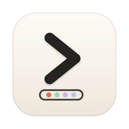
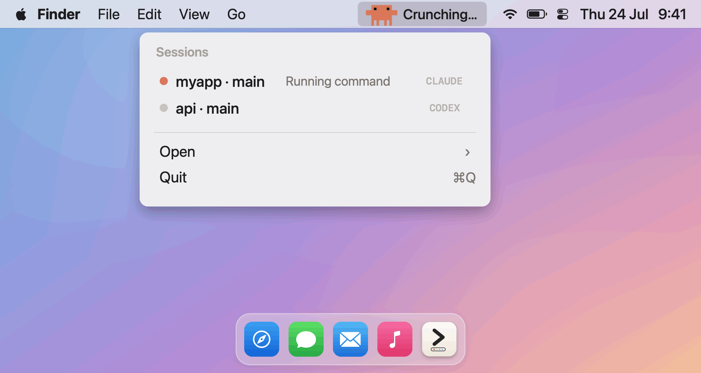
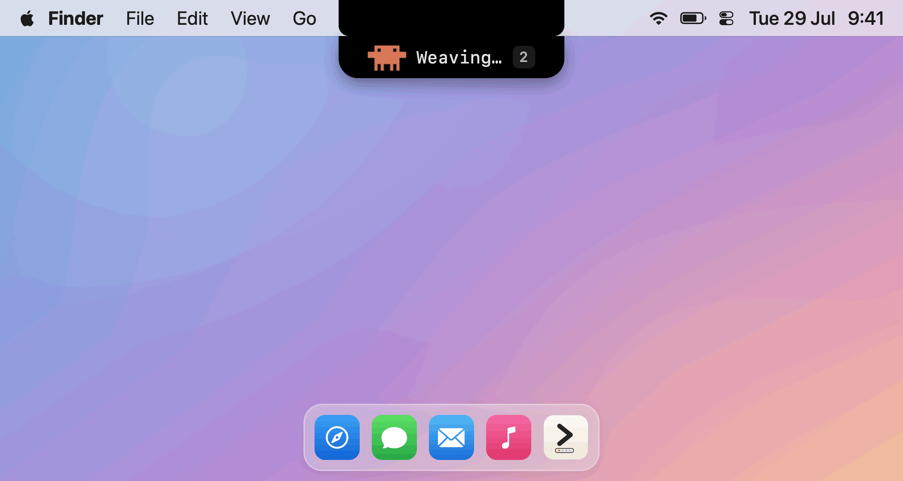
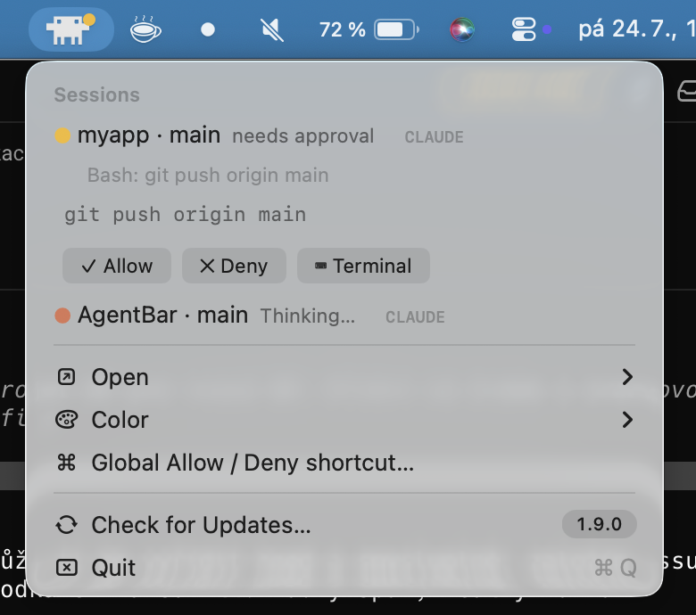

#  AgentBar

[](https://github.com/michalstrnadel/AgentBar/actions/workflows/ci.yml)
[](LICENSE)


**One menu bar item for all your AI coding agents.**

<p align="center">
  
  <br><sub><b>Menu bar mode</b></sub>
</p>

<p align="center">
  
  <br><sub><b>Dynamic Island mode</b> — pick either (or both) in the welcome window</sub>
</p>

AgentBar is a lightweight, native macOS app that shows the live state of your
AI coding sessions — Claude Code and Claude Cowork, Codex, Cursor CLI, Gemini CLI,
Qwen Code, OpenCode, plus GitHub Copilot and Google Antigravity in one place. Each agent gets its own mark built from its
real identity — Clawd the crab for Claude, the OpenAI knot with a braille dot-matrix
for Codex, the official pixel-art head for Copilot, the pixel rainbow arch for
Antigravity — and it always surfaces the session that needs you most.
Live in the **menu bar**, as a **Dynamic Island** pill under the notch, or both —
you pick on first launch.
On Linux, the same protocol drives the [`agentbar` CLI](#linux-cli).
On Windows, [AgentBar for Windows](https://github.com/michalstrnadel/AgentBar-Windows) is a
native system-tray counterpart that shares the same `~/.agentbar` hook protocol.

## Quick start

```bash
curl -fsSL https://raw.githubusercontent.com/michalstrnadel/AgentBar/main/Scripts/install.sh | bash
```

1. The app lands in `/Applications` (or `~/Applications` when that isn't
   writable; `AGENTBAR_INSTALL_DIR` overrides), launches, and installs its hooks.
   A welcome window asks where it should live — menu bar, Dynamic Island, or both.
2. Open a **new** Claude Code session (hooks load at session start) and give it any task.
3. Watch it: the mascot animates while the agent works, and the moment it
   asks for permission you get a **needs approval** row — click **✓ Allow**,
   **✓ Always**, or **✕ Deny** right there. No terminal switch needed.

That's the whole loop. More install options below; troubleshooting at the bottom.

### What the installer changes (and how to undo it)

AgentBar is local-only — no telemetry, and the only network call it ever makes is the
update check against GitHub Releases. The install touches exactly these,
all reversible (see [Uninstall](#uninstall)):

- Copies the hook scripts to `~/.agentbar/hooks/`.
- Merges AgentBar hook entries into your Claude Code settings — `~/.claude/settings.json`,
  and your `CLAUDE_CONFIG_DIR` if you set one. Existing hooks are preserved.
- Adds a `notify` line to `~/.codex/config.toml` **only if you use Codex and have none**;
  merges into `~/.cursor/hooks.json` / `~/.gemini/settings.json` /
  `~/.gemini/antigravity{,-cli}/hooks.json` / `~/.qwen/settings.json`
  **only if those exist**.
- Copies a plugin to `~/.config/opencode/plugins/agentbar.js` **only if you use OpenCode**.
- The SessionStart hook launches AgentBar in the background when an agent session begins.
- Nothing else is granted automatically: the exact-tab jump-back asks for
  **Automation** access the first time you click a row, and approving a plan
  (or a Codex/Copilot prompt) asks for **Accessibility**. Decline either and
  AgentBar falls back to bringing the app forward and letting you answer there.

The installer prints this summary before doing anything, and never modifies a tool you
don't use. Hooks are snapshotted per session — start a new agent session afterward.

## Features

- **Two surfaces, your pick** — the classic **menu bar** item, a **Dynamic Island**
  pill under the notch, or **both**. Pick it in the welcome window on first launch,
  change it any time from **Appearance…**; no relaunch. See
  [Dynamic Island](#dynamic-island).
- **Live status per agent** — an animated mascot works the bar while an agent works:
  Clawd the crab (Claude), the knot + a braille dot-matrix that literally spells
  *codex* (Codex), the pixel mascot head + dots spelling *copilot* (Copilot), and the
  animated pixel rainbow arch (Antigravity).
- **Permission alerts** — an amber dot the moment an agent waits for your approval.
- **Multi-session** — every running session listed with its agent's mark, project, git
  branch, state and elapsed time; click a row to jump to its app or terminal.
- **Open anything** — launch any supported agent (Claude, Codex, Copilot,
  Antigravity, Cursor, Gemini, Qwen, OpenCode) straight from the menu.
- **Two looks** — full-color mascots, or a monochrome System mode that matches the menu bar.
- **Remote Allow/Deny** — answer Claude Code permission prompts straight from the menu:
  see exactly what's requested, then Allow once, Always allow, Deny, or defer to terminal.
- **Answer questions too** — when Claude asks a multiple-choice question, the island
  and the menu show the actual options: tap one and the session continues, no
  terminal switch. The terminal wizard stays live the whole time — whoever answers
  first wins. Multi-question calls become a one-question-at-a-time wizard on the
  island: each tap records and slides to the next, with Back and a 2/4 mark.
- **Plan review** — when Claude finishes planning, the full plan renders on the
  island as formatted Markdown (scrollable when long). **Keep planning** sends
  Claude back to refine it without touching the terminal; **Approve plan** jumps
  to the session's exact tab and answers the plan dialog for you.
- **Usage at a glance** — provider quota read from the CLIs' own local files (no
  network, no keychain). Codex reports the exact percentage of its 5-hour and
  weekly windows with real reset times; Claude publishes no quota locally, so
  its line is the honest half-measure — the tokens its transcripts record for
  the current 5-hour block. Shown while the data is fresh, hidden when it isn't.
- **A failure looks like one** — a turn that errors out shows red and named
  instead of a green "Done", and never plays the finish chime.
- **Precise jump-back** — clicking a session row selects the exact terminal tab
  or split pane the session runs in (iTerm2, Terminal.app, WezTerm — by tty),
  not just the app.
- **Turn recaps** — a finished session's row says *what* finished: one line of the
  agent's closing words under "Done", not just a green dot.
- **Activity breadcrumb** — while a session works, the island hero shows its last
  few tool steps ("Reading · Searching · Editing"), so you can tell a session
  that is grinding through files from one that is thinking.
- **Sound cues (opt-in)** — four tiny synthesized retro-console motifs: needs
  approval, question, done, and an answer-confirm tick. Generated in code (no audio
  files), silent while your screen is locked, off until you flip them on in Settings
  or the menu.
- **Built-in updates** — a quiet daily check of GitHub Releases plus **Check for
  Updates…** in the menu; one click installs the new version and relaunches.
- **Linux too** — the [`agentbar` CLI](#linux-cli) is a full peer of the menu bar app:
  live status, pending approvals, `a`/`d` remote Allow/Deny, digit keys to answer
  questions, waybar module.
- **Nothing else** — no dock icon, no countdown timers, no sounds unless you ask
  for them, nothing that unfolds over your screen on its own. One process, tiny
  footprint.

## Requirements

- macOS 12+ (Apple Silicon or Intel) for the menu bar app — or Linux via the
  [`agentbar` CLI](#linux-cli)
- Node.js (for the hook scripts; found via Homebrew paths or your login shell)
- Xcode Command Line Tools to build the macOS app from source

## Install

**One-liner** — downloads the latest release (or builds from source when none exists):

```bash
curl -fsSL https://raw.githubusercontent.com/michalstrnadel/AgentBar/main/Scripts/install.sh | bash
```

**Homebrew:**

```bash
brew install --cask michalstrnadel/tap/agentbar
```

**Via your AI agent** — paste into Claude Code (or any coding agent):

> Install AgentBar: run
> `curl -fsSL https://raw.githubusercontent.com/michalstrnadel/AgentBar/main/Scripts/install.sh | bash`

**From source:**

```bash
git clone https://github.com/michalstrnadel/AgentBar.git && cd AgentBar
./Scripts/build.sh
open "build/AgentBar.app"
```

First launch installs hooks automatically for every supported tool you have —
see the [agent table](#agent-support). New agent sessions appear in the bar from then on.

**Updating:** the app checks GitHub Releases daily and offers new versions in the menu
(**Check for Updates…** works any time). Homebrew users can keep using
`brew upgrade --cask agentbar` — both paths install the same bundle.

> **What install touches:** hook scripts are copied to `~/.agentbar/hooks/`, hook
> entries are merged into your Claude `settings.json` (`~/.claude` **and** a custom
> `CLAUDE_CONFIG_DIR`, both; existing hooks are preserved), a `notify` line is added
> to `~/.codex/config.toml` only if none exists, and — only for tools you already
> have — hook entries are merged into `~/.cursor/hooks.json`,
> `~/.gemini/settings.json`, `~/.gemini/antigravity{,-cli}/hooks.json` and
> `~/.qwen/settings.json`, and the OpenCode plugin is copied to
> `~/.config/opencode/plugins/agentbar.js`. A config that exists but isn't valid
> JSON is never touched. The Claude SessionStart hook also auto-launches AgentBar
> in the background when a session begins. Hooks are snapshotted per session —
> start a new agent session after installing.

## Linux (CLI)

The protocol is just files (`~/.agentbar`, see [docs/protocol.md](docs/protocol.md))
and the hooks are plain Node — so on Linux, the `agentbar` CLI is the frontend:

```bash
git clone https://github.com/michalstrnadel/AgentBar.git && cd AgentBar
./Scripts/cli/agentbar install-hooks   # wires Claude/Codex/Cursor/Antigravity/Gemini/Qwen/OpenCode hooks
sudo ln -s "$PWD/Scripts/cli/agentbar" /usr/local/bin/agentbar   # optional

agentbar                 # session list (same rows as the macOS menu)
agentbar watch           # live view; a = allow, d = deny, 1-9 = answer a question, q = quit
agentbar requests        # pending approvals & questions with the mini-diff / options
agentbar approve --always
agentbar answer Blue     # answer a pending question by option label (or number)
```

Remote Allow/Deny works exactly like on macOS: while `agentbar watch` (or a
`waybar` poll) is running, a Claude Code permission prompt appears in the CLI and
your `a`/`d` answers it — and when Claude asks a multiple-choice question, its
options render right in the list and a digit key (or `agentbar answer`) picks one.
With no watcher running, hooks stay silent and the normal terminal prompt appears. Waybar module:

```jsonc
"custom/agentbar": {
  "exec": "agentbar waybar", "return-type": "json", "interval": 15
}
```

The module's `class` (and `alt`) is one of `permission`, `question`, `working`,
`idle` or `empty`, in that priority order — style them in your waybar CSS; the
text is `✋ n` / `❓ n` / `● n` / the session count.

The CLI works on macOS too (same protocol, handy over SSH). A native tray app
(StatusNotifierItem) may come later if there's demand.

## Uninstall

```bash
osascript -e 'quit app "AgentBar"'
rm -rf ~/.agentbar
# remove the AgentBar hook entries (they all reference ~/.agentbar/hooks/):
#   ~/.claude/settings.json (and your CLAUDE_CONFIG_DIR) — delete rules whose command contains "/.agentbar/hooks/"
#   ~/.codex/config.toml       — delete the notify line referencing "/.agentbar/hooks/"
#   ~/.cursor/hooks.json       — delete entries whose command references "/.agentbar/hooks/cursor/"
#   ~/.gemini/settings.json    — delete hook groups whose command references "/.agentbar/hooks/gemini/"
#   ~/.gemini/antigravity/hooks.json and ~/.gemini/antigravity-cli/hooks.json
#                              — delete the top-level "agentbar" key
#   ~/.qwen/settings.json      — delete hook groups whose command references "/.agentbar/hooks/claude/"
rm -f ~/.config/opencode/plugins/agentbar.js
```

## Agent support

| Agent | Live status | Open | Mascot | Notes |
|---|---|---|---|---|
| Claude Code (CLI + desktop) | full | yes | Clawd the crab | hooks: prompt, tool, permission, stop, lifecycle |
| Claude Cowork (desktop) | working / approval / question / done — **older local mode only** | yes | Clawd the crab | watched, not hooked: Cowork gives each session a throwaway config dir, so there is nothing to install into. `CoworkWatcher` reads the audit log the app writes per session. **Newer desktop builds run Cowork inside a VM that writes no session files on the host — those sessions can't be shown until the app exposes something host-side** |
| Codex CLI | turn-complete | yes | knot + braille dot-matrix | via Codex `notify` (auto-installed); no per-tool granularity upstream |
| Cursor CLI | working / done | yes | pointer | hooks in `~/.cursor/hooks.json` (auto-wired if Cursor is installed) |
| Gemini CLI | working / done | yes | spark | hooks in `~/.gemini/settings.json` (auto-wired if Gemini is installed) |
| GitHub Copilot | — | yes | pixel head + dot-matrix | no public event API yet; everything else is wired and waiting |
| Qwen Code | working / done / failed | yes | Q ring | Claude-style hooks in `~/.qwen/settings.json` (auto-wired if Qwen is installed); remote approval waits until its decision contract is verified |
| OpenCode | working / approval / done / failed | yes | prompt chevron | plugin in `~/.config/opencode/plugins/` (auto-installed if OpenCode is installed); observe-only |
| Google Antigravity | working / done | yes | pixel rainbow arch + dot-matrix | hooks in `~/.gemini/antigravity{,-cli}/hooks.json` (auto-wired); desktop 2.3.x only honors per-workspace `.agents/hooks.json`, and only `PostToolUse` fires — quiet sessions decay to done |

Hook readiness: Claude Code, Codex (`notify`), Cursor (`hooks.json`), Gemini
(`settings.json`), Antigravity (`hooks.json`), Qwen Code (`settings.json`), and
OpenCode (plugin) hooks all install automatically at launch (idempotently — every
launch re-checks, nothing is duplicated) for the tools you have. Copilot ships with its mascot, menu entry, and
the keystroke-approval backend already in place — the moment it exposes session
events, support is one small hook script away.

## Dynamic Island

Instead of (or alongside) the menu bar item, AgentBar can live as a pill just under
the notch:

- **At rest it's tiny** — the mark of whichever agent is working, plus one line of
  what it's doing, plus a count once two or more sessions are live. Nothing running,
  and it shrinks to the mark alone. It never grows on its own: even a pending
  approval stays a pill that says *approve?*.
- **Push the pointer up to the notch and it opens** — whatever needs you leads as
  a boxed hero row: what you asked for ("You: fix the auth bug in middleware"), a
  coloured status line, and chips naming the agent, model, the terminal (or app)
  it lives in and how long it's been at it. The other sessions follow as quiet
  one-liners named by their task. Click a row to jump to that session. The
  collapsed pill itself is click-through and never opens by accident: tab strips
  and toolbars living at the top of a maximized window stay fully usable under it.
- **Answer right there** — a waiting approval is a proper *Permission Request*
  card: the tool and its target, the mini-diff with **+3 −1** counts, **Allow** /
  **Deny** in front and *Always allow* / *Answer in terminal* quiet beside them.
  Your answer flashes back in the pill — **✓ Allowed** — as the panel folds away.
  An **AskUserQuestion** shows the actual options as tappable cards; several
  questions become a wizard, one at a time, with a **2/4** mark and **‹ Back**.
  An **ExitPlanMode** shows the whole plan as formatted Markdown with
  **Keep planning** / **Approve plan**. A failed turn says *failed* in red and
  stays silent — no green tick, no chime.
- **It scrolls when it must** — the panel is sized to its content, and past the
  screen limit the rows scroll while the **⋯** menu and the quota line stay
  pinned along the bottom.
- **No notch, or an external display?** Same panel, centred at the top of whichever
  screen your pointer is on. It steps aside for fullscreen windows, and it never
  takes focus — you can keep typing in your editor with the panel open.

In Island-only mode the menu bar item is hidden, so the panel's **⋯** button carries
Appearance, Color, the Sounds toggle, Settings, Check for Updates and Quit.

## Remote Allow/Deny

<p align="center">
  
</p>

When a Claude Code session asks for permission, the request appears right under the
yellow "needs approval" row: what's requested (e.g. `Bash: git push origin main`; full
input in the tooltip) plus an inline button strip — **✓ Allow**, **✓ Always** (only
when Claude Code suggests a rule; the rule is in the tooltip), **✕ Deny**, and
**⌨ Terminal** / **⧉ Claude app** to answer in the session's own UI instead. Clicking
the session row does the same hand-off. Decisions return through Claude Code's PermissionRequest hook,
so the terminal prompt never appears; if AgentBar isn't running, quits mid-wait, or
you ignore the request for 10 minutes, the prompt shows in the terminal exactly as
before. (Known cosmetic issue: the terminal dialog can flash briefly even when
approved from the menu — upstream [claude-code #12176](https://github.com/anthropics/claude-code/issues/12176).)

Codex and Copilot have no decision hooks, so their rows offer *Approve in terminal
(sends keystroke)* — AgentBar focuses the session's terminal and presses the approval
key. Best-effort by design, and it needs the Accessibility permission (the menu item
offers to open System Settings until it's granted).

**Approving a plan** works the same way, for a different reason: Claude Code
ignores a hook's *allow* at the plan dialog, because approving a plan also
picks the next permission mode — something a hook decision can't express. So
**Approve plan** selects the session's exact tab and answers the dialog there.
It needs Accessibility, and a terminal AgentBar can aim (iTerm2, Terminal.app,
WezTerm); anywhere else the button hands you the dialog instead of typing into
a tab it cannot verify. **Keep planning** needs none of that — it goes through
the hook as an explicit "refine this first".

## How it works

Tiny hook scripts (Node.js) write one JSON file per session to `~/.agentbar/state.d/`.
The app watches that folder and renders. No sockets, no daemons; the only network
traffic is the update check against GitHub Releases.
Permission approvals use two more folders of the same protocol: the blocking hook
writes `requests.d/`, the app answers into `answers.d/`. The contract is
[docs/protocol.md](docs/protocol.md); everything outside the Swift app (hooks,
bridges, the OpenCode plugin, the CLI) is covered by four bash test suites that
run on Linux and macOS — see [docs/testing.md](docs/testing.md).

## Troubleshooting

- **No sessions appear** — hooks load when a session starts: open a *new* agent
  session after installing. If you use a custom `CLAUDE_CONFIG_DIR`, see
  [issue #4](https://github.com/michalstrnadel/AgentBar/issues/4).
- **Cowork sessions don't appear** — newer Claude desktop builds run Cowork inside
  an isolated VM: the session's audit log lives on the VM's disk image, so nothing
  exists on the host for AgentBar to read. Upstream limitation; sessions from the
  older host-side "local mode" still show.
- **Still nothing** — the installer needs `node`; if none is found the Claude hooks
  are skipped (logged to Console.app). Install Node.js and relaunch AgentBar.
- **Codex rows never show** — if `~/.codex/config.toml` already had a `notify`
  entry, AgentBar deliberately leaves it alone; wire `Scripts/hooks/codex/notify.js`
  into your existing notify chain manually.
- **Keystroke approval does nothing** — grant AgentBar the Accessibility permission
  (the menu item offers to open System Settings).
- **macOS says it "cannot verify AgentBar is free of malware"** — the app is ad-hoc
  signed, not notarized. Don't click *Move to Trash*; click *Done*, then either
  right-click the app ▸ Open, or run
  `xattr -dr com.apple.quarantine /Applications/AgentBar.app` and open it again.
  The install script and the Homebrew cask do this for you; the dialog mainly
  appears after downloading the zip manually from Releases.
- **`brew outdated` reports an old AgentBar version** — the in-app updater swaps
  `/Applications/AgentBar.app` without telling Homebrew, so brew's install record
  lags behind after an in-app update. Run `brew upgrade --cask agentbar` to
  re-sync; both update paths install the exact same release bundle, so nothing
  is lost either way.

## License

MIT — see [LICENSE](LICENSE). Third-party marks: see
[THIRD_PARTY_NOTICES.md](THIRD_PARTY_NOTICES.md).
