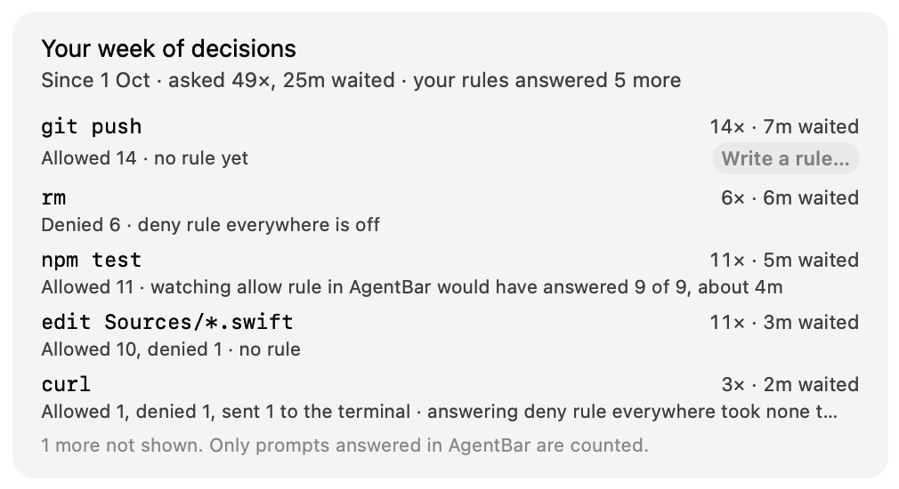
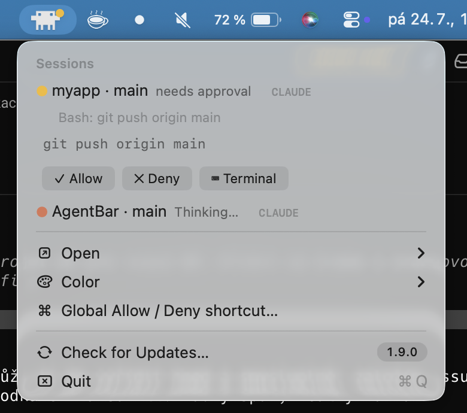

#  AgentBar

[](https://github.com/michalstrnadel/AgentBar/actions/workflows/ci.yml)
[](LICENSE)


**One approval queue for every AI coding agent.**

<p align="center">
  
</p>

**Why.** Your agents stop and ask before they run something, and the question waits
in whichever terminal tab they happen to be in. AgentBar is where they ask — every
agent, every session, in the menu bar or under the notch — so you answer in a click
instead of hunting for the window. Nothing is answered behind your back: only you
do, or a rule you wrote yourself, and every answer is written down.

### Things to try

| Do this | AgentBar does that |
|---|---|
| Give Claude Code, Codex or Copilot a task that runs a command | A **needs approval** card with the exact command (a mini-diff for an edit); **Allow** or **Deny** in one click, no terminal switch |
| **Try an approval** in the welcome window | A made-up request waits at the notch (or in the menu bar) — answer it the way you would a real one, before any agent is wired. Nothing runs |
| Click **Deny with a note…** and type *"use pnpm here, not npm"* | The agent reads the note as the reason and changes course instead of trying the next thing |
| Push the pointer up to the notch | The island opens: every session, what it is doing, and the one that needs you on top |
| Click a session row | Jumps to the exact tab or pane — iTerm2, Terminal, WezTerm, tmux — or brings forward the app it runs in |
| Answer the same prompt the same way five times | The card offers to write it down as a rule; a new rule starts out **watching** and answers nothing until you let it |
| Type `git push --force origin main` into a rule's test field | Says on the spot whether that rule would have taken it, and which clause stopped it |
| Switch on ⌥⌘A / ⌥⌘D in **Settings ▸ Shortcuts** | Allows or denies the newest request from any app |
| **New Task…** in the menu (or ⌥⌘N, once switched on) | A project, an agent and one line of what you want; the agent opens in a terminal with the prompt given |
| Turn on **Hide the island when nothing is running** (or **…while you're away**) | The pill slips out of sight; push the pointer up to the notch to peek. Anything waiting on you keeps it up |
| **Settings ▸ Agents ▸ Show changes…** | Every write AgentBar made into an agent's settings, as a unified diff, with the copy it kept beside the file |
| Flip an agent's switch off in **Settings ▸ Agents** | Shows what it will take out of that agent's settings, then removes only AgentBar's own entries — and leaves them out from then on |
| `agentbar report --agent aider --name Aider --state tool --label Editing --pid $$` | Any tool you run joins the bar under its own name and mark — wrap it in a few lines, no Swift |
| **Your Day…** in the menu or the island's ⋯ | Your day — or week — with your agents on one card: who you were today, agent time, the hours, your top agent, what changed, your answers; copy it, post it, or save it as a video |
| Click the cup in the island's footer | **Keep Mac Awake** while your agents work: the Mac stays up while a session runs and sleeps five minutes after its last turn. Right-click or hold for 15 or 30 minutes, an hour, two, until a time, or until you say. The keyboard goes dark while you're away; display, battery, chat-app Away and closed-lid options are in Settings ▸ Keep Awake |
| Drag a screenshot or a file onto a session in the island | Its path lands in that agent's prompt — pasted into the right tab, never with Return |
| Let a quota window run hot | The meter says when it runs out at this pace — "out ~15:40" — when that is before it resets |
| Right-click a session in the island | **Continue in** another agent: the launcher opens in the same project with a prompt that says where the work got to — Return is still yours |
| `open agentbar://focus` from Shortcuts or Raycast | Jumps to the session waiting on you — and no link can approve or deny anything |

**What it covers.** Agents: Claude Code and Claude Cowork, Codex, Cursor CLI, Gemini
CLI, GitHub Copilot, Google Antigravity, Qwen Code and OpenCode — plus Cursor cloud
agents, Devin and Codex cloud tasks, and sessions on your own machines over ssh.
Terminals: any — the exact tab in iTerm2, Terminal, WezTerm and tmux, best effort in
kitty, Ghostty and VS Code, Cursor or Zed, and anything else (Warp included) comes
forward as the app the agent runs in. Sessions: as many at once as you run, the one
that needs you first. Approvals: a per-repo history of what you decided, and rules
you wrote, every firing on record. Surfaces: the menu bar, a Dynamic Island under
the notch, or both, pinned to the display you pick. Elsewhere: the
[`agentbar` CLI](#linux-cli) on Linux, and
[AgentBar for Windows](https://github.com/michalstrnadel/AgentBar-Windows), a native
system-tray counterpart on the same `~/.agentbar` hook protocol.

## Quick start

```bash
curl -fsSL https://raw.githubusercontent.com/michalstrnadel/AgentBar/main/Scripts/install.sh | bash
```

1. The app lands in `/Applications` (or `~/Applications` when that isn't
   writable; `AGENTBAR_INSTALL_DIR` overrides), launches, and installs its hooks.
   A welcome window asks where it should live — menu bar, Dynamic Island, or both.
2. Open a **new** Claude Code session (hooks load at session start) and give it any task.
3. Watch it: the mascot animates while the agent works, and the moment it
   asks for permission you get a **needs approval** row — click **✓ Allow**,
   **✓ Always**, or **✕ Deny** right there. No terminal switch needed.

That's the whole loop. More install options below; troubleshooting at the bottom.

### What the installer changes (and how to undo it)

AgentBar is local-only — no telemetry, and it talks to three places, two of which stay
silent until you switch them on: the daily update check against GitHub Releases, and
— only if you tick **Settings ▸ Usage** — Claude's own quota, from `api.anthropic.com`
using the login Claude Code already stored, or from `claude.ai` if you sign in there.
That switch reports what came back, in a sentence under itself, including every way it
can fail; **Check now** asks again on the spot. The simplest way in is **Sign in to Claude…**, which opens claude.ai's own login
page in a window and keeps the session in AgentBar — no terminal, no token, and no
reading of your browser's cookies, which AgentBar does not do. If your sessions run under their own `CLAUDE_CONFIG_DIR`, that login is somewhere
AgentBar cannot read — **Use a token…** takes one from `claude setup-token` and keeps it
in AgentBar's own Keychain item, which is the only secret this app stores and the same
button removes. Everything else, including every token count
and every other provider's quota, is read from files already on your disk.
The install touches exactly these, all reversible (see [Uninstall](#uninstall)):

- Copies the hook scripts to `~/.agentbar/hooks/`.
- Merges AgentBar hook entries into your Claude Code settings — `~/.claude/settings.json`,
  and your `CLAUDE_CONFIG_DIR` if you set one. Existing hooks are preserved.
- Writes into `~/.codex/config.toml` **only if you use Codex**: a `notify` line if
  it has none, and a hooks block between two marker comments — what is outside them
  stays as you wrote it, and Codex asks you once before running any of it.
  Merges into `~/.cursor/hooks.json` / `~/.gemini/settings.json` /
  `~/.gemini/antigravity{,-cli}/hooks.json` / `~/.qwen/settings.json`
  **only if those exist**. Writes its own `~/.copilot/hooks/agentbar.json`
  **only if you use Copilot** — a separate file, so your own hooks stay untouched.
- Copies a plugin to `~/.config/opencode/plugins/agentbar.js` **only if you use OpenCode**.
- Copies the [Claude Code mod](#claude-code-mods) to `~/.agentbar/mods/` — and that is
  all, until you switch it on: it is the one integration that starts **off**.
- The SessionStart hook launches AgentBar in the background when an agent session begins.
- **Before it writes into any of those settings files it keeps the file as it was, beside
  it** — `settings.json.agentbar-bak-20261001-142233` (local time) — and keeps only the
  newest three of its own copies per file. A launch that would change nothing writes
  nothing and keeps nothing, so the copies only appear when something actually moved.
  **Settings ▸ Agents ▸ Show changes…** (or **See what changed…** in the welcome
  window) shows every write as a unified diff with the copy it kept, and what a re-install
  would change right now before you let it. On Linux, `agentbar install-hooks` prints the
  same diff for each file before writing it and keeps the same copies.
- Every agent it finds is wired, unless you turned it off: the switch in **Settings ▸
  Agents**, `agentbar unwire <id>` on Linux (or `install-hooks --skip a,b`
  / `--only a,b`). Turning one off takes AgentBar's entries back out of that agent's
  settings — backed up and diffed like any other write — and every later run leaves it
  alone (`~/.agentbar/wire-disabled`). `agentbar wire <id>` or the switch puts it back.
- Nothing else is granted automatically: the exact-tab jump-back asks for
  **Automation** access the first time you click a row, and approving a plan
  (or a Codex/Copilot prompt) asks for **Accessibility**. Decline either and
  AgentBar falls back to bringing the app forward and letting you answer there.

The installer prints this summary before doing anything, and never modifies a tool you
don't use. To undo a single change, copy the `.agentbar-bak-…` file back over the original. Hooks are snapshotted per session — start a new agent session afterward.

## Features

<p align="center">
  
  <br><sub><b>Menu bar mode</b></sub>
</p>

<p align="center">
  
  <br><sub><b>Dynamic Island mode</b> — pick either (or both) in the welcome window</sub>
</p>

<p align="center">
  
  <br><sub><b>Hand a file to an agent</b> — and a session gone quiet, and when the limit runs out</sub>
</p>

- **Two surfaces, your pick** — the classic **menu bar** item, a **Dynamic Island**
  pill under the notch, or **both**. Pick it in the welcome window on first launch,
  change it any time from **Appearance…**; no relaunch. See
  [Dynamic Island](#dynamic-island).
- **Live status per agent** — an animated mascot works the bar while an agent works:
  Clawd the crab (Claude), who acts out what the session is doing in
  [twelve scenes](#clawds-scenes), the knot + a braille dot-matrix that literally spells
  *codex* (Codex), the pixel mascot head + dots spelling *copilot* (Copilot), and the
  animated pixel rainbow arch (Antigravity).
- **Notifications that only carry what wants you** — off by default, and three
  separate switches: an agent **needs approval** (Allow and Deny on the banner
  itself, answerable without switching apps), a session **failed**, and **everything
  went quiet** — one summary of the whole batch, and only once you have actually been
  away from the keyboard for a couple of minutes. Nothing is announced for merely
  finishing. **Send a test** checks they reach you; if nothing appears but it shows up
  in Notification Center, a Focus is on — macOS files banners rather than showing
  them, which is working as designed.
- **What happened today, with its weight** — sessions that finished, how long they
  actually worked (not how long their windows were open), what they cost and what
  moved in the repo: *"12 sessions · 3h 40m · 4.1M
  tokens"*, and per row *"AgentBar · 34m · 1.2M · 7 files +210 −80"*. Token counts
  come from each agent's own local files (Claude's transcript, Codex's rollout,
  Copilot's session store); the agents that publish nothing simply show nothing,
  never a zero. In the menu bar dropdown it is the **Today** row, and behind the
  island's **⋯**. **Appearance…** can also put it along the bottom of the island —
  the day's total, a bar per session, or both. `agentbar history` says the same in a terminal. Live status forgets a session
  the moment it ends; this doesn't.
- **Pick the island's display** — on a multi-monitor desk the island can be pinned
  to one screen instead of following the pointer around. The welcome window draws
  your displays the way System Settings does; unplug the pinned one and it falls
  back to the pointer until it's back.
- **Permission alerts** — an amber dot the moment an agent waits for your approval.
- **It remembers what you decided** — the fifth time an agent asks to run the same
  thing, the card says so: *“Allowed 23× here · last Tue”*, counted per repo, because
  a command that is routine in one checkout is the opposite in another. Once a prompt
  has been allowed five times and never refused, **✓ Always** is pointed at — pointed
  at, never pressed. Kept in `~/.agentbar/decisions.jsonl`, never sent anywhere,
  switchable off in **Settings ▸ Approvals**, and `agentbar forget` empties it.
  Keystroke approvals (Antigravity, and Codex sessions older than its hooks) write
  **nothing**: a key pressed at a terminal is not a decision anybody here witnessed.
- **Rules you wrote** — the one thing AgentBar will answer without asking, and only
  ever a rule you typed yourself. When you have answered the same prompt the same way
  five times, the card offers to write it down; **Settings ▸ Rules** is where they
  live, in plain JSON at `~/.agentbar/rules.json` that you can edit by hand. Writing
  one shows you what it will **not** answer, and gives you a field where you type a
  real command — `git push --force origin main` — and are told on the spot whether
  this rule would have taken it, and which clause stopped it. A new rule starts out
  **watching**: it answers nothing and writes down what it *would* have done, so you
  can look at a week of that before you let it speak for you. The rule's line says
  whether *you*, answering those same prompts, did what it would have done — and once
  it has matched you ten times across three days without a single disagreement, it
  offers a **Let it answer** button that still asks before it changes anything. A rule
  that **refuses** may cover every repository on the machine. A rule that **approves**
  names one — and before it answers, the command itself is checked again, not just its
  shape: anything chained, piped, redirected or substituted, anything under `sudo`, a
  destructive git or `rm`, anything reaching off this Mac, a path outside that
  directory, or anything that touches how permission itself is configured comes back
  to you. No setting turns that off. Every firing writes a row naming the rule, so
  **Settings ▸ Rules** and `agentbar rules` can tell you what each one has
  actually done. Nothing in the file applies while any of it is wrong, and
  Diagnostics says so — because a rule that silently stopped working looks exactly
  like AgentBar working normally.
- **Your week of decisions** — the top of **Settings ▸ Approvals** lists the five
  prompts that held your agents up longest over the last seven days: how often you
  were asked, how long they waited (*“14× · 7m waited”*, or *“at least”* when an
  older hook left a wait unrecorded), and how you answered. Beside each one is the
  rule you already wrote for it — and while it is watching, what it would have done:
  *“would have answered 9 of 9, about 4m”*. A prompt with no rule that you answered
  the same way five times offers **Write a rule…**, which opens the ordinary rule
  sheet filled in; the rule starts out watching and is saved only when you press
  **Add rule**. Only your own answers in AgentBar are counted.

  
- **How long they waited on you** — the other half of the day's account, under
  **Today**: *“18 answered · 3 by your rules · they waited 34m on you”*. Nothing else
  on the machine is standing in the right place to measure it, and the two counts stay
  apart — a rule's answer is not one you gave. `agentbar approvals` says the same, with
  the prompts you answer most.
- **Multi-session** — every running session listed with its agent's mark, project, git
  branch, state and elapsed time; click a row to jump to its app or terminal.
- **Open anything** — launch any supported agent (Claude, Codex, Copilot,
  Antigravity, Cursor, Gemini, Qwen, OpenCode) straight from the menu.
- **Start a task, not just an agent** — **New Task…** in the menu (or ⌥⌘N, once you
  switch that on) opens a small panel: a project you have worked in, an agent, and a
  line of what you want. The agent opens in a terminal, in that directory, with the
  prompt already given. It closes the moment it loses focus and takes no space until
  you ask for it. The prompt goes in as an argument, never as synthesized
  keystrokes, and only to the agents whose CLI documents one — the rest open in the
  right place and wait for you to type. A terminal that can't be handed a command
  (Warp) gets the command on your clipboard and says so, rather than opening on the
  wrong thing.
- **Two looks** — full-color mascots, or a monochrome System mode that matches the menu bar.
- **Remote Allow/Deny** — answer Claude Code permission prompts straight from the menu:
  see exactly what's requested, then Allow once, Always allow, Deny, or defer to terminal.
- **A diff you can actually read** — an edit shows the lines that *moved*, with a line
  of context and a marker where untouched lines were skipped. Where a single line was
  edited, the characters that changed stay at full strength and the rest of the line
  fades, and a change past the right edge slides into view instead of truncating —
  both halves by the same amount, so the columns still line up. The `+N −M` beside it
  counts what moved, not the size of the window it moved in.
- **Answer questions too** — when Claude asks a multiple-choice question, the island
  and the menu show the actual options: tap one and the session continues, no
  terminal switch. The terminal wizard stays live the whole time — whoever answers
  first wins. Multi-question calls become a one-question-at-a-time wizard on the
  island: each tap records and slides to the next, with Back and a 2/4 mark.
- **Allow all alike** — three agents waiting on the same `npm test` in the same
  folder are one decision: the card says **Allow all 3**. Only the exact same
  request counts (same tool, the whole same input, the same directory), only the
  ones on screen when you click, and each goes into the approval history as your
  own answer.
- **Deny with a note** — refuse and say what to do instead: *"use pnpm here, not
  npm"*. Type it on the island card (**Deny with a note…**), on the notification
  banner, or `agentbar deny --note "…"`; the agent reads it as the reason and changes
  course rather than trying the next thing. On a plan it is the feedback the plan
  goes back with. A denying rule can carry one too (**Tell it**), so a refusal you
  wrote down once explains itself every time it fires.
- **Plan review** — when Claude finishes planning, the full plan renders on the
  island as formatted Markdown (scrollable when long). **Keep planning** sends
  Claude back to refine it without touching the terminal; **Approve plan** jumps
  to the session's exact tab and answers the plan dialog for you.
- **What's left, at a glance** — one small meter per provider, answering one
  question: how much is spent and how much is left. On the **island** it is the
  footer line, drawn rather than written, at the height that line always had; in
  the **menu** it is the fuller block, with both windows and their reset times. **Codex** reports the exact
  percentage of its 5-hour and weekly windows with real reset times, plus a credit
  balance when the account has one. **Copilot** carries its own priced ledger, so its
  line is what it actually charged today in its own AIU — and it gets *no* bar, because
  the ceiling lives on github.com and a meter drawn against a guessed one would be a
  picture of a number that doesn't exist. **Claude** keeps its windows on its own
  servers: tick **Settings ▸ Usage** and AgentBar asks for them with the login Claude
  Code already stored (off by default, five-minute polling, and it never touches your
  refresh token); leave it off and you get the tokens its transcripts record for the
  current 5-hour block. A window past its reset says so rather than repeating the old
  number, everything is hidden the moment it goes stale, and `agentbar usage` says the
  same in a terminal.
- **Will it last?** — AgentBar fits a line through the last 45 minutes of each quota
  window and, only when it says the window runs out **before it resets**, tells you
  when: "out ~15:40" on the island (amber inside the last half hour), "At this pace:
  limit ~15:40 (+18 %/h)" in the menu. A forecast that changes nothing says nothing,
  and none of it ever notifies.
- **Carry it on elsewhere** — when a session's quota is half an hour from running out,
  its row says **out ~15:40 ↗**; click it (or right-click any session row, or use
  **Continue … Elsewhere** in the menu) and pick another agent. The launcher opens
  in the same project with that agent and a prompt that says where the work got to —
  your last prompt, the agent's last update, and "look at `git diff` first". You read
  it, you press Return; the first session is left exactly as it was.
- **Hand a file to an agent** — drag files, an image from the browser, or a
  screenshot thumbnail up to the notch and drop it on a session: its path goes into
  that agent's prompt, escaped the way Terminal escapes a dragged file. It is pasted
  only into a tab AgentBar has verified is that session's own (iTerm2, Terminal,
  WezTerm, tmux), and **Return is never pressed** — you add the words. In any other
  terminal the path is copied and the row says ⌘V. Switch on **Your latest screenshot
  in the island** (Settings ▸ General) and a screenshot from the last three minutes
  waits in the open island's footer, a drag away from any session.
- **A quiet session asks** — a working session with no word from its agent for ten
  minutes (or 20, 30, never — Settings ▸ General) says **quiet 12m?** on its row. A
  question, not an alarm: a long test run is quiet too. One click jumps to it.
- **A failure looks like one** — a turn that errors out shows red and named
  instead of a green "Done", and never plays the finish chime.
- **Precise jump-back** — clicking a session row selects the exact terminal tab
  or split pane the session runs in: iTerm2, Terminal.app, WezTerm and **tmux**
  (pane, window and client — then the terminal hosting it) by tty; kitty (with
  remote control on), Ghostty and the VS Code, Cursor or Zed window best effort.
  Anything else comes forward as the app the agent actually runs in, found by its
  process ancestry rather than guessed from `TERM_PROGRAM`.
- **Turn recaps** — a finished session's row says *what* finished: one line of the
  agent's closing words under "Done", not just a green dot.
- **Activity breadcrumb** — while a session works, the island hero shows its last
  few tool steps ("Reading · Searching · Editing"), so you can tell a session
  that is grinding through files from one that is thinking.
- **Sound cues (opt-in)** — four tiny synthesized retro-console motifs: needs
  approval, question, done, and an answer-confirm tick. Generated in code (no audio
  files), silent while your screen is locked, off until you flip them on in Settings
  or the menu. **Or your own:** drop `permission`, `question`, `done` or `ack`
  (`.wav`, `.aiff`, `.caf`, `.mp3`, `.m4a`, up to 2 MB and 3 s) into
  `~/.agentbar/sounds/` — Settings ▸ General ▸ **Open folder…**.
- **Shortcuts, Raycast, Alfred** — `open agentbar://focus` jumps to the session
  waiting on you; `agentbar://new-task?cwd=…&agent=…&prompt=…` fills the launcher in
  (Return is still yours). No link can approve, deny or answer anything. See
  [docs/url-scheme.md](docs/url-scheme.md).
- **Built-in updates** — a quiet daily check of GitHub Releases; a new version is
  downloaded, checked against the running app's own signing certificate, and
  installed automatically once nothing is waiting on you and you have stepped away.
  Switch it off in Settings ▸ General to install from **Check for Updates…** instead.
- **Take a break** — the joystick beside ⋯ on the island offers two small games.
  **Space Bugs** is an arcade shooter: Clawd against a formation of bugs, with a
  score, a best and a few tokens to catch. It steps aside the moment an agent needs
  you — the request shows in its place, and **Back to the break** picks up where you
  left off. Arrows and Space to play, P to pause, Esc to close. Island only.
  **Bug Hunt** is the second: bugs rise out of the grass and you have three shots
  to bring each one down, then the dog fetches it (or laughs when it gets away). Ten
  bugs a round, enough hits to go on, a perfect round for a bonus; Game A flies one
  at a time, Game B two. Aim with the pointer and click, or the arrows and Space. It
  steps aside for your agents exactly like Space Bugs.
- **Release notes where you'll look for them** — **Settings ▸ What's New** has the
  notes of the update on offer before it installs, and of every release that arrived
  since you last looked, marked **New**. After an update the menu offers
  **What's New in …** for two weeks; nothing opens by itself.
- **Linux too** — the [`agentbar` CLI](#linux-cli) is a full peer of the menu bar app:
  live status, pending approvals, `a`/`d` remote Allow/Deny, digit keys to answer
  questions, waybar module.
- **Nothing else** — no dock icon, no countdown timers, no sounds unless you ask
  for them, nothing that unfolds over your screen on its own. One process, tiny
  footprint.

## Your Day

<p align="center">
  
  &nbsp;
  
</p>

**Your Day…** — in the menu bar's menu and the island's ⋯ — puts your day with
your agents on one card, the way a year-in-music recap does, built to be read in a
glance and made to be shared. **This week** switches it to the last seven days.

- **Agent time** first, as the one big number — the time agents were actually
  *working*, not how long their windows were open — and **who you were today** under it
  as a sentence — The Orchestrator, The Marathoner, The Night Owl, The Delegator,
  The Quick Draw… — with the number that earned it.
- **The day as bars**, hour by hour, in the colour of the agent that had each
  hour, with **your peak** — the most agents at once — marked by a thin line, and
  **you** underneath: a dot for every hour you typed prompts or answered requests,
  bigger the more you did. A week marks its best day instead.
- Then a plain list: **your top agent** and its share, **what changed in your
  repos**, **your answers** (how many your rules gave, how long the agents waited
  on you), **your prompts**, **the longest run**, **the busiest hour** and **where
  the work went**. Flat paper and ink — the agents' colours
  appear on their bars and nowhere else.
- **Honest numbers, as everywhere in AgentBar**: working time comes from Claude
  Code's own transcript (every prompt and every step is stamped; a silence of more
  than five minutes inside a turn is waiting, not work) or, for other agents, from
  the stretches AgentBar saw them in thinking or tool. A session with neither is
  counted but gets no time. A figure measured on some sessions says so ("9 of 21
  sessions"), and a fact with nothing behind it gets no row rather than a zero. Lines are *what changed in the repo* while the agents ran,
  not a claim about who wrote them.
- **Share it**: **Copy** (⌘C) puts the card on the clipboard; **Share** saves it
  as a story (1080 × 1920) or square PNG, saves it building itself as a 6-second MP4
  or a looping GIF, or hands it to the share sheet. **Project names stay out of
  everything you export** unless you tick **Include Project Names** in that menu.
- It never opens by itself. It builds once when it opens, then holds still — a click
  or Space builds it again, Esc closes — and Reduce Motion shows it finished.
- `agentbar://day` and `agentbar://week` open it from Shortcuts or Raycast.

## Take a break

Two small games live in the island, one click away on the joystick beside ⋯. They
open only when you ask, pause the moment you click elsewhere, and step aside the
instant an agent needs you.

<p align="center">
  
  
</p>

## Clawd's scenes

Clawd shows what Claude is doing, and what it's waiting for. There are **twelve
scenes**, each chosen from what the session reports and none of them made up. Each plays to the end of its
loop before the next starts, so he doesn't flicker when Claude moves between thinking
and tools.

<p align="center">
  
</p>

| Claude is… | Clawd… |
|---|---|
| starting a turn, or quiet for 6 s | faces you and thinks, dots filling in above his head |
| reading (`Read`) | turns the pages of a book |
| searching (`Grep`, `Glob`) | sweeps a magnifier |
| editing (`Edit`, `Write`) | types on a laptop |
| running a command (`Bash`) | hammers on an anvil |
| on the web (`WebFetch`, `WebSearch`) | sends waves from an antenna |
| delegating to a subagent | works beside a little Clawd |
| compacting its context | squashes a box shut |
| using any other tool | walks |
| waiting for your approval | raises a hand, with an amber **!** |
| asking you a question | raises a hand, with a blue **?** |
| quiet for 10 minutes | falls asleep, z's drifting up |

They are drawn as text art in the source and rendered at runtime, in both colour
modes. At rest the menu bar never moves, so there Clawd sleeps as a still picture;
only the island, with the mascot's personality on, lets him breathe. [How they were made, and how to add one →](docs/clawd-scenes.md)

## Requirements

- macOS 12+ (Apple Silicon or Intel) for the menu bar app — or Linux via the
  [`agentbar` CLI](#linux-cli)
- Node.js (for the hook scripts; found via Homebrew paths or your login shell)
- Xcode Command Line Tools to build the macOS app from source

## Install

**Homebrew** — the recommended way:

```bash
brew install --cask michalstrnadel/tap/agentbar
```

**One-liner** — downloads the latest release (or builds from source when none exists):

```bash
curl -fsSL https://raw.githubusercontent.com/michalstrnadel/AgentBar/main/Scripts/install.sh | bash
```

**Via your AI agent** — paste into Claude Code (or any coding agent):

> Install AgentBar: run
> `curl -fsSL https://raw.githubusercontent.com/michalstrnadel/AgentBar/main/Scripts/install.sh | bash`

**From source:**

```bash
git clone https://github.com/michalstrnadel/AgentBar.git && cd AgentBar
./Scripts/build.sh          # add --native if the x86_64 half fails to link
open "build/AgentBar.app"
```

`./Scripts/build.sh` produces a universal binary, which needs a full Xcode: recent
Command Line Tools ship the Swift compatibility libraries for arm64 only, so the
x86_64 half won't link without one. `--native` builds for your Mac alone, which is
all you need to run it yourself.

First launch installs hooks automatically for every supported tool you have —
see the [agent table](#agent-support). New agent sessions appear in the bar from then on;
ones already open started before the hooks and stay out of it until you start another.

**What you'll see the first time:** Homebrew and the one-liner clear the download
quarantine, so macOS opens the app without its "cannot verify" warning — that one
appears only for a zip downloaded by hand (see [Troubleshooting](#troubleshooting)).
If your projects live in Documents, Desktop or Downloads, macOS asks once whether
AgentBar may read them; that is for the git branch and changes shown on each row,
and nothing leaves your Mac.

**Updating:** the app checks GitHub Releases daily and updates itself automatically —
it downloads the new version, checks its signature against the running app's own
certificate, and relaunches as it the next time nothing is waiting on you and you have
been away for five minutes (or at the next launch). **Settings ▸ General ▸ Install
updates automatically** turns that off; the menu then offers the update instead, and
**Check for Updates…** works any time. Homebrew users can keep using
`brew upgrade --cask agentbar` — both paths install the same bundle. Either way, what
changed is in **Settings ▸ What's New**, from the changelog the new version carries.

> **What install touches:** hook scripts are copied to `~/.agentbar/hooks/`, hook
> entries are merged into your Claude `settings.json` (`~/.claude` **and** a custom
> `CLAUDE_CONFIG_DIR`, both; existing hooks are preserved), and **`~/.codex/config.toml`
> gets a `notify` line if it has none, plus a hooks block between
> `# >>> agentbar >>>` and `# <<< agentbar <<<`** — everything outside those two
> lines is left byte for byte, and **Codex asks you once** before it runs any of
> it, so writing them decides nothing on your behalf. Then — only for tools you
> already have — hook entries are merged into `~/.cursor/hooks.json`,
> `~/.gemini/settings.json`, `~/.gemini/antigravity{,-cli}/hooks.json` and
> `~/.qwen/settings.json`, and the OpenCode plugin is copied to
> `~/.config/opencode/plugins/agentbar.js`. A config that exists but isn't valid
> JSON is never touched. The Claude SessionStart hook also auto-launches AgentBar
> in the background when a session begins. Hooks are snapshotted per session —
> start a new agent session after installing.

## Linux (CLI)

The protocol is just files (`~/.agentbar`, see [docs/protocol.md](docs/protocol.md))
and the hooks are plain Node — so on Linux, the `agentbar` CLI is the frontend:

```bash
git clone https://github.com/michalstrnadel/AgentBar.git && cd AgentBar
./Scripts/cli/agentbar install-hooks   # wires Claude/Codex/Cursor/Antigravity/Gemini/Qwen/Copilot/OpenCode hooks
sudo ln -s "$PWD/Scripts/cli/agentbar" /usr/local/bin/agentbar   # optional

agentbar                 # session list (same rows as the macOS menu)
agentbar watch           # live view; a = allow, d = deny, 1-9 = answer a question, q = quit
agentbar requests        # pending approvals & questions with the mini-diff / options
agentbar approve --always
agentbar answer Blue     # answer a pending question by option label (or number)
agentbar history         # what finished today (--days N, --json)
agentbar usage           # what's left of each provider's quota
agentbar approvals       # the prompts you keep answering (--days N, --json)
agentbar rules           # the rules you wrote and what each has done (--json)
agentbar forget          # empty the decision ledger
agentbar doctor          # why an agent isn't showing up; --json for a bug report
```

`agentbar doctor` is the thing to run when an agent simply never appears. It
re-derives the whole installation from disk — is `node` where the configs say it
is, are the hooks wired, is `~/.agentbar` writable, when did each agent last
report — and answers in the words of the fix. Every check id is listed in
[`docs/diagnostics.md`](docs/diagnostics.md).

Remote Allow/Deny works exactly like on macOS: while `agentbar watch` (or a
`waybar` poll) is running, a Claude Code or Copilot CLI permission prompt appears in the CLI and
your `a`/`d` answers it — and when Claude asks a multiple-choice question, its
options render right in the list and a digit key (or `agentbar answer`) picks one.
With no watcher running, hooks stay silent and the normal terminal prompt appears.

**Rules are listed here, not applied here.** `agentbar rules` reads the same
`~/.agentbar/rules.json` the app does and says what is in it, but only the macOS app
answers from a rule. The check that makes an approving rule safe — the live command,
not its shape — is one table in one language, and a second copy of it in the CLI
would be a second thing to keep byte-identical in the one place where drifting apart
means approving something nobody meant to. The command says so in its own output.

Waybar module:

```jsonc
"custom/agentbar": {
  "exec": "agentbar waybar", "return-type": "json", "interval": 15
}
```

The module's `class` (and `alt`) is one of `permission`, `question`, `working`,
`idle` or `empty`, in that priority order — style them in your waybar CSS; the
text is `✋ n` / `❓ n` / `● n` / the session count.

**Updating:** the CLI has no release channel of its own — `git pull` in the
checkout is the update, and re-run `install-hooks` afterwards so the copies in
`~/.agentbar/hooks/` are refreshed. (On macOS the app does that for you on every
launch; on Linux the CLI *is* AgentBar, so nothing does it behind your back.)

`install-hooks` writes an absolute path to the `node` that will run the hooks,
because a GUI-launched agent's `PATH` can't be relied on. It picks a *stable*
path — `/usr/bin/node`, `/usr/local/bin/node`, `/opt/homebrew/bin/node` or
`~/.local/bin/node` — whenever one of those is the same binary as the `node`
running the CLI, rather than the version-pinned path a version manager resolves
to. A hook config outlives the next `node` upgrade; if it named
`…/node/v20.11.0/bin/node`, every hook would silently stop firing the day you
upgrade. On a version manager with no stable alias it falls back to the running
interpreter, so re-run `install-hooks` after a major `node` change.

The CLI works on macOS too (same protocol, handy over SSH). A native tray app
(StatusNotifierItem) may come later if there's demand.

## Uninstall

To take **one** agent out and keep the rest, don't edit its settings by hand: flip its
switch in **Settings ▸ Agents**, or run `agentbar unwire <id>` (e.g.
`agentbar unwire cursor`). Either one removes exactly AgentBar's entries — keeping a
copy of the file beside it first — and remembers the choice, so the next launch or
`install-hooks` doesn't wire it again. `agentbar wire <id>` undoes it.

To remove everything:

```bash
osascript -e 'quit app "AgentBar"'
rm -rf ~/.agentbar
# remove the AgentBar hook entries (they all reference ~/.agentbar/hooks/):
#   ~/.claude/settings.json (and your CLAUDE_CONFIG_DIR) — delete rules whose command contains "/.agentbar/hooks/"
#   ~/.codex/config.toml       — delete the notify line referencing "/.agentbar/hooks/",
#                                and the block from "# >>> agentbar >>>" to "# <<< agentbar <<<"
#                                (plus any [hooks.state] entry naming that file, which is
#                                 Codex's record of you having accepted them)
#   ~/.cursor/hooks.json       — delete entries whose command references "/.agentbar/hooks/cursor/"
#   ~/.gemini/settings.json    — delete hook groups whose command references "/.agentbar/hooks/gemini/"
#   ~/.gemini/antigravity/hooks.json and ~/.gemini/antigravity-cli/hooks.json
#                              — delete the top-level "agentbar" key
#   ~/.qwen/settings.json      — delete hook groups whose command references "/.agentbar/hooks/claude/"
#   only if you switched the Claude Code mod on: in each Claude settings.json, drop the
#   entry containing "/.agentbar/mods/" from env.CLAUDE_CODE_PLUGIN_DIRS
#   (or run `agentbar unwire claude-mod` before the rm above)
# Copilot and OpenCode are whole files AgentBar owns, so they just go:
rm -f ~/.copilot/hooks/agentbar.json
rm -f ~/.config/opencode/plugins/agentbar.js
./Scripts/cloud/install.sh uninstall   # only if you installed the cloud poller
# the copies AgentBar kept of each settings file before writing it (newest three each);
# copy one back over the original instead if you want that version, then delete the rest:
# (find rather than a glob: zsh refuses a pattern that matches nothing)
find ~/.claude ~/.codex ~/.cursor ~/.gemini ~/.gemini/antigravity ~/.gemini/antigravity-cli \
     ~/.qwen ~/.copilot/hooks ${CLAUDE_CONFIG_DIR:+"$CLAUDE_CONFIG_DIR"} \
     -maxdepth 1 -name '*.agentbar-bak-*' -delete 2>/dev/null
```

Wiping `~/.agentbar` takes `cloud.json` (and its API keys) with it; the poller's
launchd agent has to be booted out separately, which is what the `cloud/install.sh uninstall` line does.

## Agent support

| Agent | Live status | Open | Mascot | Notes |
|---|---|---|---|---|
| Claude Code (CLI + desktop) | full | yes | Clawd the crab | hooks: prompt, tool, permission, stop, lifecycle. Optional [mod](#claude-code-mods) (2.1.287+, **off by default**): what Claude Code ran without asking you, and its live context and quota |
| Claude Cowork (desktop) | working / approval / question / done — **older local mode only** | yes | Clawd the crab | watched, not hooked: Cowork gives each session a throwaway config dir, so there is nothing to install into. `CoworkWatcher` reads the audit log the app writes per session. **Newer desktop builds run Cowork inside a VM that writes no session files on the host — those sessions can't be shown until the app exposes something host-side** |
| Codex CLI | full hooks | yes | knot + braille dot-matrix | hooks auto-installed; **Codex asks once before it runs them** |
| Cursor CLI | working / done | yes | pointer | hooks in `~/.cursor/hooks.json` (auto-wired if Cursor is installed). No remote approval: its hooks can **refuse** a tool call but not approve one — see [what each agent will let somebody else decide](docs/permission-surfaces.md) |
| Gemini CLI | working / done | yes | spark | hooks in `~/.gemini/settings.json` (auto-wired if Gemini is installed). No remote approval, for the same reason as Cursor: `BeforeTool` takes `block`, `deny` or `ask`, and has no `allow` |
| GitHub Copilot CLI | working / done / failed / **approval** | yes | pixel head + dot-matrix | Claude-shaped hooks in `~/.copilot/hooks/agentbar.json` (auto-wired if Copilot is installed; needs CLI 1.0.67+ and a fresh session — it reads hook config only at startup). **Remote Allow/Deny** via its `permissionRequest` hook; no "Always", which its output contract has no room for |
| Qwen Code | working / done / failed | yes | Q ring | Claude-style hooks in `~/.qwen/settings.json` (auto-wired if Qwen is installed); remote approval waits until its decision contract is verified |
| OpenCode | working / approval / done / failed | yes | prompt chevron | plugin in `~/.config/opencode/plugins/` (auto-installed if OpenCode is installed); observe-only |
| Google Antigravity | working / done | yes | pixel rainbow arch + dot-matrix | hooks in `~/.gemini/antigravity{,-cli}/hooks.json` (auto-wired); desktop 2.3.x only honors per-workspace `.agents/hooks.json`, and only `PostToolUse` fires — quiet sessions decay to done |
| Devin (cloud) | working / blocked / finished / suspended | yes | D letterform | no local process at all — rows come from the [cloud poller](Scripts/cloud/), clicking opens the exact thread in Devin Desktop (or the web) |
| Your own agent | idle / working / question / done / failed | yes | generic letter mark + its name | anything else: wrap it with `agentbar report --agent <id> --name <Name> --state …` or write the [file protocol](docs/protocol.md#bring-your-own-agent) directly. Ready-made, wired by hand: [Aider](Scripts/hooks/aider/) (a wrapper on its notification command), [goose](Scripts/hooks/goose/) (a hooks plugin), [Cline](Scripts/hooks/cline/) (its task hooks, extension and CLI), [Amp](Scripts/hooks/amp/) (a plugin). No approvals — a report has no hook waiting on the answer |

Hook readiness: Claude Code, Codex (`config.toml`), Cursor (`hooks.json`), Gemini
(`settings.json`), Antigravity (`hooks.json`), Qwen Code (`settings.json`),
Copilot CLI (`hooks/agentbar.json`), and OpenCode (plugin) hooks all install
automatically at launch (idempotently — every launch re-checks, nothing is
duplicated) for the tools you have. Copilot reads its hook config once at
startup, so a session already open won't report until you restart it.

Which of them you can actually answer *for* is a shorter list than which of them
report, and the difference is the vendor's, not AgentBar's:
[what each agent will let somebody else decide](docs/permission-surfaces.md)
records it per agent, measured, with the version each answer was measured against.

## Claude Code mods

Claude Code 2.1.287 and later loads **mods**: plugins whose code runs inside Claude
Code itself and sees every tool call — including the ones it settles without ever
showing you a prompt, because a rule in your settings or your permission mode already
said yes. AgentBar's hooks only hear about the prompts; the AgentBar mod hears about
the rest.

**What it does.** For each Claude Code session it writes one small file to
`~/.agentbar/mods.d/` ([format](docs/protocol.md#modsd--what-claude-code-decided-without-asking-and-what-it-measures)):
the calls Claude Code allowed or refused on its own — by which rule, by your mode, by a
hook, or by **auto mode instead of asking you** — and Claude Code's own figures for the
context window and the five-hour and weekly limits. A call another mod is holding for
you in its own pane (blast-radius does that for `rm -r`) shows up in AgentBar as a
session waiting on you, "Held before it runs: …", instead of looking busy. AgentBar turns each of those decisions into a line of your record
(**Settings ▸ Claude Code ▸ Answered without you**) and shows the quota without asking
Anthropic's servers.
Read-only tools (Read, Grep, Glob and the like) are left out: they change nothing.

**What it never does.** It answers nothing, holds nothing and changes nothing: every
hook passes Claude Code's own result through untouched. It writes only into
`~/.agentbar`, and sends nothing anywhere. The one thing it can draw — a line above
your prompt when *another* session is waiting on you — stays off until you switch
on **Settings ▸ Claude Code ▸ Show other agents waiting** (it writes
`~/.agentbar/mods/config.json`, which the mod reads).

**Turning it on.** **Settings ▸ Agents ▸ Claude Code mod**, or `agentbar wire claude-mod`
on Linux. Like every other switch it shows the change first: one entry in
`env.CLAUDE_CODE_PLUGIN_DIRS` of each Claude `settings.json`, beside any plugin
directories of your own, with the file kept as it was beside it. Start a new Claude
Code session afterwards — a mod loads at session start. Off again takes exactly that
entry back out (`agentbar unwire claude-mod`). On a Claude Code older than 2.1.287 the
switch stays disabled and says so.

**Plugins that can answer for you.** A mod is not the only thing that can settle a
prompt before AgentBar sees it: any plugin with a `PreToolUse` or `PermissionRequest`
hook can, and so can a mod hooked on `tool.call` or `tool.check`. **Settings ▸ Claude Code ▸
Claude Code plugins that can answer for you** lists every enabled plugin that could,
with a sentence on what it can do ("can hold or refuse Bash commands before they run"),
and names the rest that are loaded. Nothing there is a problem — it is so that a prompt
which never came is never a mystery. `agentbar doctor` prints the same list.

## Cloud agents

Runs that live on a vendor's infrastructure — **Cursor cloud agents**, **Devin
sessions**, **Codex cloud tasks** — have no local pid, tty, or hook, but they are
sessions all the same. The optional [`Scripts/cloud/`](Scripts/cloud/) poller
mirrors them into the bar as protocol rows (`entrypoint: "cloud"` plus a `url`);
a row click opens the run where it actually lives: the `cursor://` run deep
link, the exact thread in Devin Desktop (via its ACP URL handler, with the web
thread as the handler's own fallback), or the task on chatgpt.com. Cloud rows
never grow approval affordances — there is no local hook an answer could reach.

```bash
./Scripts/cloud/install.sh    # launchd agent + a starter ~/.agentbar/cloud.json
```

Cursor and Devin poll their REST APIs with keys from their dashboards; Codex
rides the `codex` CLI's existing login. Vendors fail independently — one expired
key collapses that vendor to a single clickable "check API key" row and never
touches the others. Setup, config, and lifecycle rules: [Scripts/cloud/README.md](Scripts/cloud/README.md).

**Your own machines, too.** The same poller can read a devbox or a GPU server over
`ssh` (off until you list hosts in `cloud.json`): the host runs AgentBar's hooks via
the Linux CLI, and its sessions appear here as `gpu: my-repo`, a click opening
`ssh://gpu`. Read-only — a remote session waiting on permission says so and is
answered where it runs.

## Dynamic Island

Instead of (or alongside) the menu bar item, AgentBar can live as a pill just under
the notch:

- **At rest it's tiny** — the mark of whichever agent is working, plus one line of
  what it's doing, plus a count once two or more sessions are live. Nothing running,
  and it shrinks to the mark alone. It never grows on its own: even a pending
  approval stays a pill that says *approve?*.
- **Or out of sight until you want it** *(both off by default)* — **Settings ▸
  General ▸ Hide the island when nothing is running** lets the pill slip away and
  come back with the next session; **…while you're away** hides it after three
  minutes without keyboard or mouse, even with agents working, and the first touch
  brings it back. Push the pointer up to the notch and a hidden pill peeks out, which
  is also how Settings stays reachable in Island-only mode. Anything waiting on you
  keeps it up — a pending approval, question or plan — and it still never opens by
  itself.
- **Push the pointer up to the notch and it opens** — whatever needs you leads as
  a boxed hero row: what you asked for ("You: fix the auth bug in middleware"), a
  coloured status line, and chips naming the agent, model, the terminal (or app)
  it lives in and how long it's been at it. The other sessions follow as quiet
  one-liners named by their task. Click a row to jump to that session. The
  collapsed pill itself is click-through and never opens by accident: tab strips
  and toolbars living at the top of a maximized window stay fully usable under it.
- **Answer right there** — a waiting approval is a proper *Permission Request*
  card: the tool and its target, the mini-diff with **+3 −1** counts, **Allow** /
  **Deny** in front and *Always allow* / *Answer in terminal* quiet beside them.
  Your answer flashes back in the pill — **✓ Allowed** — as the panel folds away.
  An **AskUserQuestion** shows the actual options as tappable cards; several
  questions become a wizard, one at a time, with a **2/4** mark and **‹ Back**.
  An **ExitPlanMode** shows the whole plan as formatted Markdown with
  **Keep planning** / **Approve plan**. A failed turn says *failed* in red and
  stays silent — no green tick, no chime.
- **The day along the bottom** *(off by default)* — **Appearance… ▸ Today, along the
  bottom** has two switches you can take separately. **The day's total** is one line:
  *"12 sessions · 3h 40m · 4.1M tokens"*. **A bar per session** draws today's finished
  sessions oldest-first, wider the longer each worked, in the agent's colour, red for
  what failed and half-lit for one nobody could time — point at a bar for its project,
  working time, tokens and what changed in its repo. Both are off until you ask, because
  the strip costs height and a day spent in a single agent draws one long bar that
  does not earn it.
- **A mascot with a little life in it** *(on for a new install)* — on the island only,
  never in the menu bar. At rest, Clawd's eyes follow the pointer as it comes near and blink now and then;
  click a mark in the open panel and it squishes (three quick clicks make it dizzy)
  — the mark is for poking, the rest of the row still jumps to the session. A long
  task finishing gets a short sparkle in the pill: only after a minute and a half of
  work, at most once per session every fifteen minutes, so a conversation of quick
  turns never sets it off. No sounds of its own. It starts on for a new
  install and stays off for one that had AgentBar before, where a click on the mark
  used to jump to the session; **Settings ▸ General ▸ Let the mascot react** is the
  switch either way, and Reduce Motion keeps it off whatever the switch says.
- **It scrolls when it must** — the panel is sized to its content, and past the
  screen limit the rows scroll while the day's strip, the **⋯** menu and the quota
  line stay pinned along the bottom.
- **No notch, or an external display?** Same panel, centred at the top of whichever
  screen your pointer is on. It stays put over fullscreen windows — that is where
  the agents are actually running — and it never takes focus, so you can keep
  typing in your editor with the panel open. The pill is 30pt tall and only opens
  when you point at it.
- **Or pin it to one display.** Following the pointer is right for a laptop and
  wrong for a fixed desk, where a status surface that moves is one you have to
  look for. **Island on:** in the welcome window draws every connected display —
  a laptop for the built-in one, notch included — and one click pins the island
  there for good. A pinned display that gets unplugged falls back to the pointer
  and re-pins itself when it returns, so AgentBar never goes missing.

In Island-only mode the menu bar item is hidden, so the panel's **⋯** button carries
everything the menu bar's own menu ends with — Icon Color, Sounds, Appearance,
Diagnostics, Settings, updates, Send Feedback and Quit — and starts with Today,
Your Day…, New Task… and Take a break. Both menus are drawn from one list, so
neither can lose a row the other has.

### Appearance

All of it lives in one window — **Appearance…** in the menu, and the same window
you get on first launch. The preview above the buttons is the real mascot driven
through the real code, not a picture of one, so it animates exactly as the bar will.

<p align="center">
  
</p>

**Island on:** draws your displays rather than listing them — a laptop for the
built-in one, notch included, a monitor on a stand for the rest. Click one and the
island stays there instead of following the pointer around, which is what a fixed
multi-monitor desk wants. Unplug a pinned display and the island falls back to the
pointer until it's back; the choice is remembered, and it is keyed to the display's
UUID, so a monitor that comes back under a different display ID is still recognised
as the same one.

## Remote Allow/Deny

<p align="center">
  
</p>

When a Claude Code or Copilot CLI session asks for permission, the request appears right under the
yellow "needs approval" row: what's requested (e.g. `Bash: git push origin main`; full
input in the tooltip) plus an inline button strip — **✓ Allow**, **✓ Always** (only
when Claude Code suggests a rule; the rule is in the tooltip), **✕ Deny**, and
**⌨ Terminal** / **⧉ Claude app** to answer in the session's own UI instead. Clicking
the session row does the same hand-off. Decisions return through Claude Code's PermissionRequest hook,
so the terminal prompt never appears; if AgentBar isn't running, quits mid-wait, or
you ignore the request for 10 minutes, the prompt shows in the terminal exactly as
before. (Known cosmetic issue: the terminal dialog can flash briefly even when
approved from the menu — upstream [claude-code #12176](https://github.com/anthropics/claude-code/issues/12176).)

**Codex answers natively too**, since 1.28.0. It speaks Claude's hook dialect, so
the same scripts serve it, and a Codex prompt arrives as a real card with real
buttons — and in the ledger, and under the rules you wrote. Two things are its own.
There is no **✓ Always**: Codex has no channel for a standing rule, so an "always"
would quietly be a one-shot allow and the button is not offered. And **Codex asks
you once before it will run a hook at all** — until you accept, the hooks do
nothing and Diagnostics says so; AgentBar will not sign that acceptance for you.

Agents with no decision hook still offer *Approve in terminal (sends keystroke)*,
and so do Codex sessions that were running before the hooks were accepted —
AgentBar brings the session's own tab forward and presses the approval key. It waits for that tab to be confirmed by tty and sends nothing if it
can't be found, so a keystroke never lands in a tab it couldn't verify — in tmux
that means both the pane and the outer terminal's tab; on terminals with no tab
targeting (Warp, Ghostty, kitty) it falls back to the app and types nothing.
Best-effort by design, and it needs the Accessibility permission (the menu item
offers to open System Settings until it's granted).

**Copilot CLI answers natively too**, through its `permissionRequest` hook — no
keystroke and no Accessibility permission. Two differences from Claude. There is no
**✓ Always**: GitHub's output contract is `{behavior, message, interrupt}`, with no
channel for a standing rule, so an "always" would quietly be a one-shot allow and
the button is simply not offered. And a session that was *already running* when
AgentBar installed the hook still falls back to keystrokes — Copilot reads hook
config only at startup, so remote approval begins with the next `copilot` session.

**Approving a plan** works the same way, for a different reason: Claude Code
ignores a hook's *allow* at the plan dialog, because approving a plan also
picks the next permission mode — something a hook decision can't express. So
**Approve plan** selects the session's exact tab and answers the dialog there.
It needs Accessibility, and a terminal AgentBar can aim (iTerm2, Terminal.app,
WezTerm); anywhere else the button hands you the dialog instead of typing into
a tab it cannot verify. **Keep planning** needs none of that — it goes through
the hook as an explicit "refine this first".

## How it works

Tiny hook scripts (Node.js) write one JSON file per session to `~/.agentbar/state.d/`.
The app watches that folder and renders. No sockets, no daemons; the only network
traffic is the update check against GitHub Releases — plus, only if you switch
**Settings ▸ Usage** on, Claude's quota from `api.anthropic.com` or `claude.ai`.
Permission approvals use two more folders of the same protocol: the blocking hook
writes `requests.d/`, the app answers into `answers.d/`. The contract is
[docs/protocol.md](docs/protocol.md); everything outside the Swift app (hooks,
bridges, the OpenCode plugin, the CLI) is covered by five bash test suites that
run on Linux and macOS — see [docs/testing.md](docs/testing.md).

## Troubleshooting

- **No sessions appear** — hooks load when a session starts: open a *new* agent
  session after installing. If you use a custom `CLAUDE_CONFIG_DIR`, see
  [issue #4](https://github.com/michalstrnadel/AgentBar/issues/4).
- **Cowork sessions don't appear** — newer Claude desktop builds run Cowork inside
  an isolated VM: the session's audit log lives on the VM's disk image, so nothing
  exists on the host for AgentBar to read. Upstream limitation; sessions from the
  older host-side "local mode" still show.
- **Still nothing** — the installer needs `node`; if none is found the Claude hooks
  are skipped (logged to Console.app). Install Node.js and relaunch AgentBar.
- **Codex rows never show** — if `~/.codex/config.toml` already had a `notify`
  entry, AgentBar deliberately leaves it alone; wire `Scripts/hooks/codex/notify.js`
  into your existing notify chain manually.
- **Keystroke approval does nothing** — grant AgentBar the Accessibility permission
  (the menu item offers to open System Settings).
- **macOS says it "cannot verify AgentBar is free of malware"** — the app is signed
  with the project's own certificate, not notarized by Apple. Don't click *Move to
  Trash*; click *Done*, then open **System Settings ▸ Privacy & Security**, scroll to
  the line about AgentBar and click **Open Anyway** (macOS 15 and later; on macOS 14
  and earlier, right-click the app ▸ Open works too). Or run
  `xattr -dr com.apple.quarantine /Applications/AgentBar.app` and open it again.
  The install script and the Homebrew cask do this for you; the dialog appears only
  after downloading the zip by hand from Releases. To check that zip first, see
  [Verifying a download](SECURITY.md#verifying-a-download).
- **`brew outdated` reports an old AgentBar version** — the in-app updater swaps
  `/Applications/AgentBar.app` without telling Homebrew, so brew's install record
  lags behind after an in-app update. Run `brew upgrade --cask agentbar` to
  re-sync; both update paths install the exact same release bundle, so nothing
  is lost either way.

## License

MIT — see [LICENSE](LICENSE). Third-party marks: see
[THIRD_PARTY_NOTICES.md](THIRD_PARTY_NOTICES.md).
