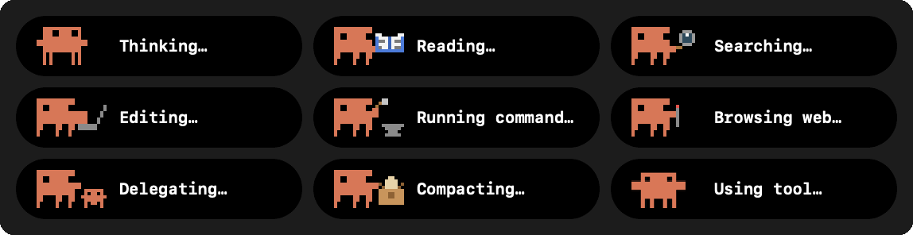

# Clawd's scenes

Clawd shows what a Claude session is doing, and what it is waiting for. There are
**twelve scenes**: eight for work, the walk for any other tool, two for waiting on
you, and sleep.

<p align="center">
  
</p>

| Scene | When | What he does |
|---|---|---|
| Thinking | a turn has started and no tool has run yet, or the session has said nothing for 6 s | turns to face you, arms out, eyes up, bobbing while three dots fill in |
| Reading | `Read` | holds an open book; it nods, and a page turns |
| Searching | `Grep`, `Glob` | sweeps a magnifier, pausing where something caught his eye |
| Editing | `Edit`, `Write`, `NotebookEdit` | types on a laptop |
| Running command | `Bash` | hammers on an anvil; sparks fly |
| On the web | `WebFetch`, `WebSearch` | an antenna sends out waves, one ring after another |
| Delegating | `Agent` (formerly `Task`) | a little Clawd steps along beside him; now and then he waves |
| Compacting | the session is summarising its context | squashes an overfull box shut |
| Walking | any tool with no picture of its own | the walk cycle |
| Needs approval | a permission request waits on you | raises a hand, an amber **!** beside him, waving now and then |
| Has a question | a question waits on you | the same hand, with a blue **?** |
| Asleep | no session has worked or waited on you for 10 minutes | eyes shut, breathing, a small z and a big Z drifting up |

## How a scene is chosen

`ClawdScene.scene(for:now:)` reads only what the hooks already write: the row's
`state`, its `label` (`Scripts/hooks/claude/update.js` names each tool) and its
`activity` list. Nothing is guessed.

- A **tool** row shows that tool's scene.
- A **thinking** row keeps the last tool's scene for 6 s. Between two tool calls
  Claude is mostly working through what the last one returned. A scene based on the
  bare state would show *Thinking* nearly the whole time and the other scenes for
  a few milliseconds each.
- **Compacting** wins over everything.
- **Waiting and sleeping** come from the state, never from a tool: a permission
  request raises the hand with **!**, a question with **?**. Either takes the place
  of the badge dot other agents wear. The **!** and **?** keep their colour in System
  mode too, as the dot did.
- **Sleep** is a still picture in the menu bar, because AgentBar's menu bar mark
  doesn't move at rest. Only the island lets him breathe, and only with the mascot's
  personality on (**Settings ▸ General ▸ Let the mascot react**), on the pointer poll
  that already drives his eyes. No separate timer runs for it. A launch counts as
  busy, so he never wakes up asleep.

`MascotReel` decides **when** the scene changes: it asks for the next one only
after the current loop has played through. A session switches between thinking and
a tool several times a second, so changing on every switch would flicker. Each
loop lasts 1.5–2.5 s.

## How they were made

1. **Text art, not image files.** Each pose is a 22 × 12 grid with one character per
   pixel (`o` body, `#` eye, `w` page, `k` lens rim…), kept in
   `Sources/AgentBar/Sprites/ClawdSceneArt.swift`. To change a pose, edit its picture
   in that file. `ClawdSceneArt.image` draws it at runtime, so no PNGs ship. The
   laptop and thinking poses are adapted from MIT-licensed art; the notice is in
   `THIRD_PARTY_NOTICES.md`.
2. **One canvas.** Every scene and the walk share one width, so the mark keeps its
   size while it works and the text beside it doesn't jump at a change of scene.
   At rest Clawd is still the walk's first frame, which is where the island finds
   his eyes.
3. **Both colour modes from the start.** In System mode,
   `IconRenderer.adaptiveTemplate` maps luminance to ink. A prop as light as the
   body would merge into one white shape, so the book cover, the lens glass and the
   fading waves are darker than the body. Each pose was checked as a colour sheet
   and as a template sheet before it went in.
4. **Checked at real size.** At 17 pt, one art pixel is about three screen pixels.
   Details that looked fine enlarged and disappeared at real size were redrawn. The
   book needed a spine before it looked like a book.
5. **Live in the app.** `Scripts/dev/sandbox.sh` runs a separate copy of the app on
   its own state folder. `agentbar report --state tool --label "Reading"` (and the
   other labels) moved it through every scene, and `screencapture -l <window id>`
   took frames of the pill. For the last check, a real Claude Code session's state
   file was copied into the sandbox, so Clawd followed the actual work.
6. **Tests** (`ClawdSceneTests`): every tool label in the hook has a scene, every pose is
   exactly 22 × 12 and uses only colours from the palette, every pose appears in its
   loop, and a reel changes scene only at the end of a loop.

## Re-rendering the GIFs

The GIF above and the share video come from the same code the app runs:

```bash
swiftc -target arm64-apple-macos12.0 \
  $(find Sources/AgentBar -name "*.swift" ! -name "main.swift") \
  Scripts/mascots/render-clawd-scenes.swift -o /tmp/render-clawd-scenes
/tmp/render-clawd-scenes /tmp/clawd

# README grid: smaller palette, no dithering (pixel art doesn't need it)
ffmpeg -i /tmp/clawd/clawd-scenes.gif -filter_complex \
  "[0]split[a][b];[a]palettegen=max_colors=64:stats_mode=full[p];[b][p]paletteuse=dither=none" \
  docs/assets/clawd-scenes.gif

# Share video, 1280×720, and a GIF of it for places that won't play video
ffmpeg -framerate 12.5 -i /tmp/clawd/showcase/f%04d.png -c:v libx264 -pix_fmt yuv420p \
  -crf 16 -preset slow -movflags +faststart -r 25 docs/assets/clawd-scenes-social.mp4
ffmpeg -framerate 12.5 -i /tmp/clawd/showcase/f%04d.png -filter_complex \
  "scale=800:-1:flags=neighbor,split[a][b];[a]palettegen=max_colors=64[p];[b][p]paletteuse=dither=none" \
  docs/assets/clawd-scenes-social.gif
```

## Adding a scene

1. Draw its poses and loop in `ClawdSceneArt.swift`, and add a case to `ClawdScene`.
2. Map the tool's label to it in `ClawdScene.scene(forTool:)`. If the hook doesn't
   name the tool yet, add it to `TOOL_LABELS` in `Scripts/hooks/claude/update.js`.
3. Add it to the `cast` in `render-clawd-scenes.swift`, re-render, and add a row to
   the table above.
